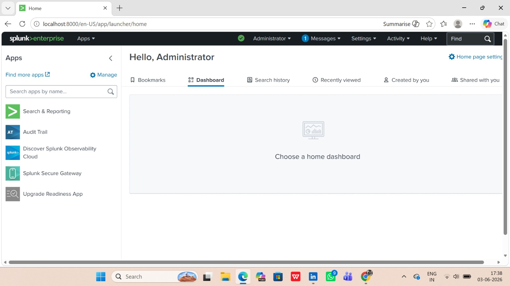
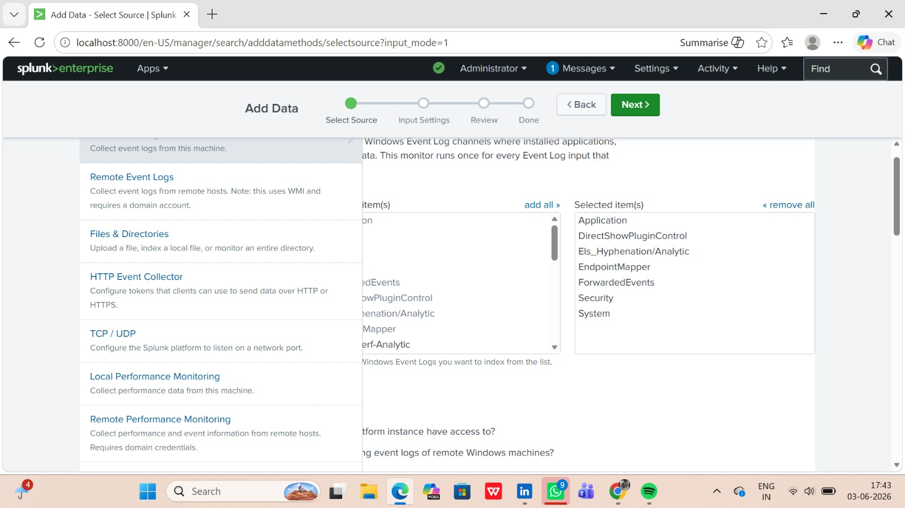
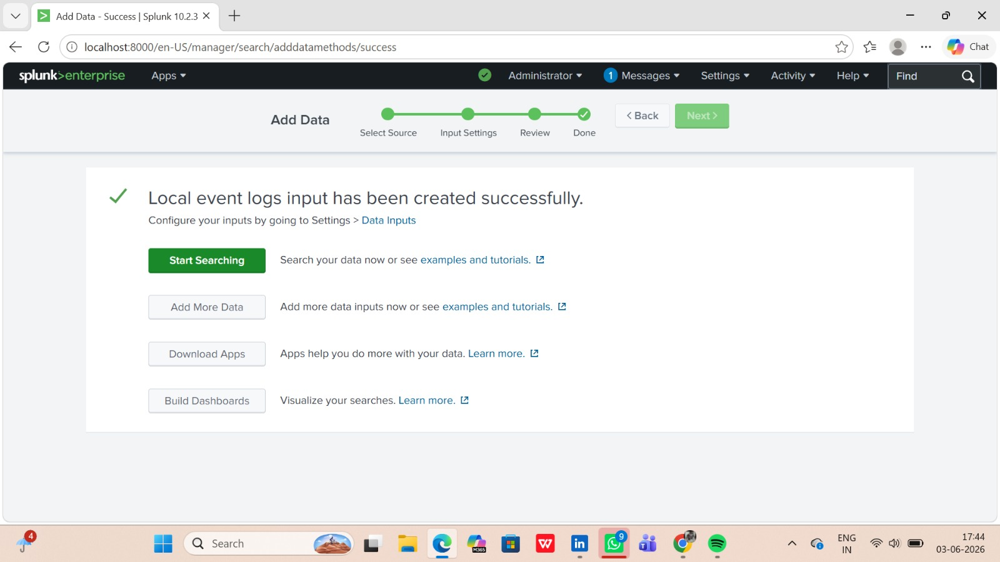
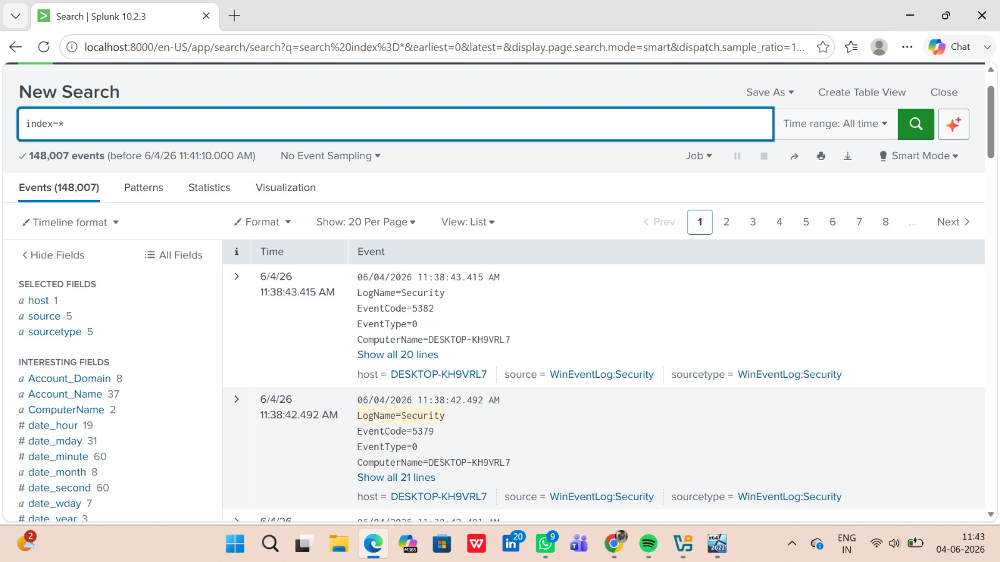
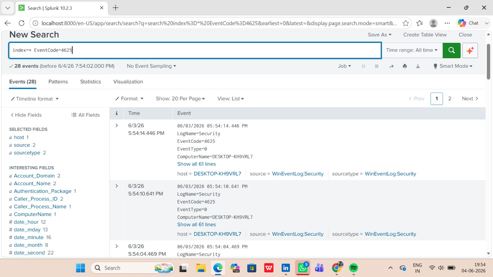
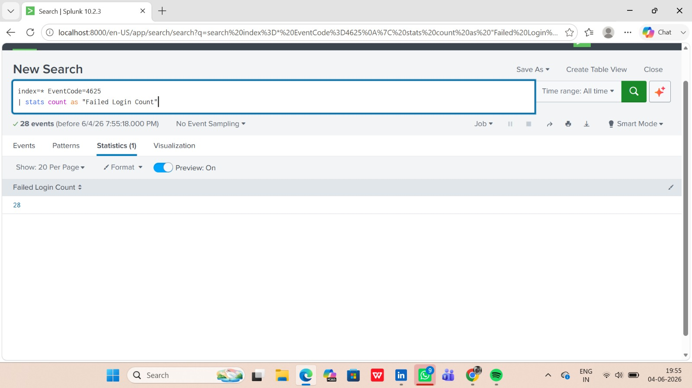
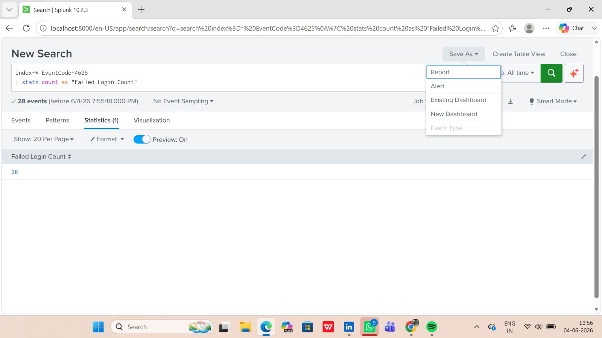
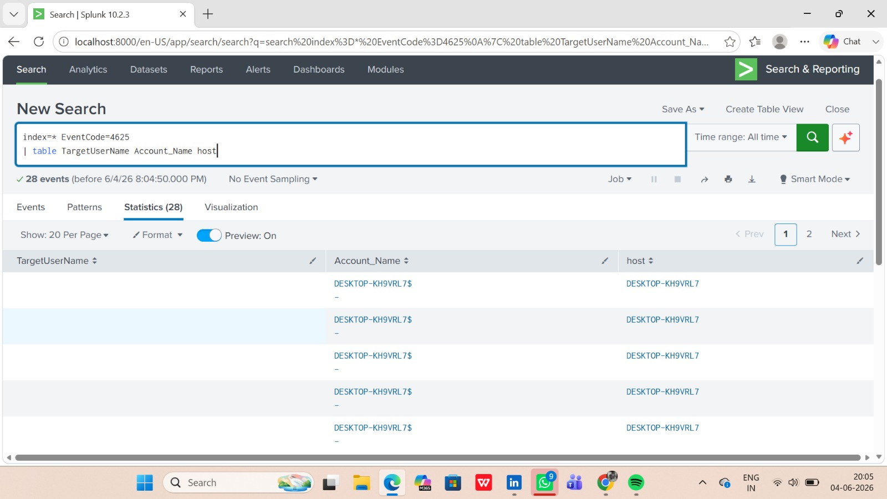
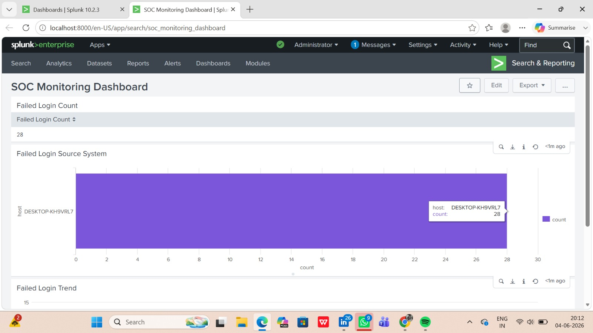
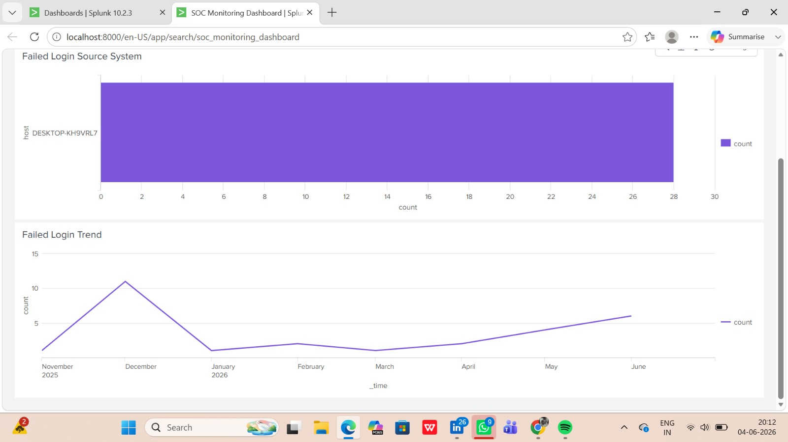

# Splunk SIEM — Failed Login Detection & SOC Dashboard

## Project Overview
Deployed Splunk Enterprise locally and built a SOC monitoring 
dashboard to detect and analyse failed Windows login attempts 
using real event log data.

## Tools Used
- Splunk Enterprise 10.2.3
- Windows Event Logs (Security, System, Application)
- SPL (Splunk Processing Language)

## What I Did
- Ingested 148,000+ real Windows Event Log entries into Splunk
- Detected 28 failed login events using EventCode 4625
- Investigated target usernames, account names, and source hosts
- Built a SOC Monitoring Dashboard with:
  - Failed Login Count panel
  - Failed Login Source System (bar chart)
  - Failed Login Trend over time (Nov 2025 – Jun 2026)
- Configured Save As Alert/Report workflow

## SPL Queries Used
See `splunk-queries.txt`

## Screenshots
| Step | Screenshot |
|------|-----------|
| Splunk Home |  |
| Data Input Setup |  |
| Ingestion Success |  |
| 148K Events Search |  |
| EventCode 4625 |  |
| Stats Query |  |
| Save As Alert |  |
| Table Query |  |
| SOC Dashboard |  |
| Trend Chart |  |

## Key Findings
- 28 failed login attempts detected from host: DESKTOP-KH9VRL7
- Peak activity: December 2025
- Recent uptick observed in June 2026
